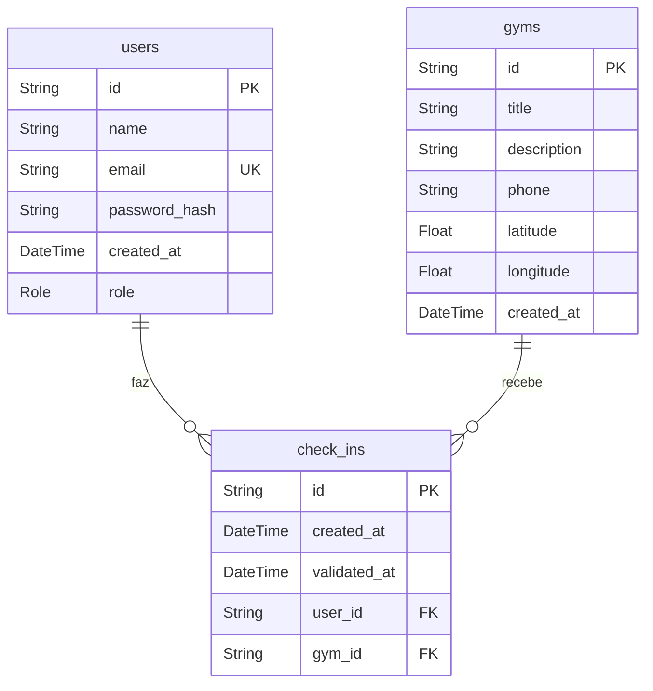

# 🏋️ GymPass API

Uma API para controle de check-ins em academias baseado em localização geográfica. Desenvolvida seguindo os princípios do **S.O.L.I.D.** e **Clean Architecture**, garantindo que a aplicação seja altamente testável, escalável e de fácil manutenção.

---

## 🚀 Tecnologias e Ferramentas

A pilha de tecnologias utilizada no projeto inclui:

- **[Node.js](https://nodejs.org/)** (v20+) - Ambiente de execução JavaScript/TypeScript.
- **[Fastify](https://fastify.dev/)** - Framework web rápido e de baixo custo de desempenho.
- **[TypeScript](https://www.typescriptlang.org/)** - Superset que adiciona tipagem estática ao JavaScript.
- **[Prisma ORM](https://www.prisma.io/)** - ORM moderno para interação produtiva e segura com o banco de dados.
- **[PostgreSQL](https://www.postgresql.org/)** - Banco de dados relacional robusto.
- **[Vitest](https://vitest.dev/)** - Framework de testes extremamente rápido.
- **[Zod](https://zod.dev/)** - Biblioteca de declaração e validação de esquemas de dados.
- **[Docker & Docker Compose](https://www.docker.com/)** - Criação de contêineres para o banco de dados.
- **[Biome](https://biomejs.dev/)** - Ferramenta rápida para formatação e linting do código.

---

## 📐 Arquitetura & Padrões (SOLID & Clean Architecture)

Este projeto foi desenhado sob forte aderência aos princípios SOLID e Clean Architecture para evitar acoplamento e facilitar os testes automatizados:

- **Single Responsibility Principle (SRP):** Cada caso de uso (`use-case`) possui uma única responsabilidade no fluxo de negócio.
- **Dependency Inversion Principle (DIP):** Os casos de uso dependem de interfaces (abstrações) de repositórios, e não das implementações diretas do Prisma, permitindo o uso de repositórios em memória para testes unitários rápidos.
- **Repository Pattern:** Abstração da camada de acesso aos dados, isolando as operações do banco de dados (Prisma/PostgreSQL) da lógica de negócios.
- **Factory Pattern:** Centralização da criação dos casos de uso e injeção de suas respectivas dependências.
- **Refresh Token Flow:** Estrutura de autenticação segura utilizando JWTs de vida curta armazenados no cabeçalho e Refresh Tokens armazenados em cookies HTTP-only.

---

## 📑 Requisitos & Regras de Negócio

### Requisitos Funcionais (RF)
- [x] Deve ser possível se cadastrar.
- [x] Deve ser possível se autenticar.
- [x] Deve ser possível obter o perfil de um usuário logado.
- [x] Deve ser possível obter o número de check-ins realizados pelo usuário logado.
- [x] Deve ser possível ao usuário obter seu histórico de check-ins.
- [x] Deve ser possível ao usuário buscar academias próximas (até 10km).
- [x] Deve ser possível ao usuário buscar academias pelo nome.
- [x] Deve ser possível ao usuário realizar check-in em uma academia.
- [x] Deve ser possível validar o check-in de um usuário.
- [x] Deve ser possível cadastrar uma academia.

### Regras de Negócio (RN)
- [x] O usuário não deve poder se cadastrar com um e-mail duplicado.
- [x] O usuário não pode fazer 2 check-ins no mesmo dia.
- [x] O usuário não pode fazer check-in se não estiver perto (até 100m) da academia.
- [x] O check-in só pode ser validado até 20 minutos após criado.
- [x] O check-in só pode ser validado por administradores (`ADMIN`).
- [x] A academia só pode ser cadastrada por administradores (`ADMIN`).

### Requisitos Não-Funcionais (RNF)
- [x] A senha do usuário precisa estar criptografada (utilizando `bcryptjs`).
- [x] Os dados da aplicação precisam estar persistidos em um banco PostgreSQL.
- [x] Todas as listas de dados precisam estar paginadas com 20 itens por página.
- [x] O usuário deve ser identificado por um JWT (JSON Web Token).

---

## 🗄️ Modelagem do Banco de Dados (Prisma Schema)

O banco de dados é estruturado em três tabelas principais mapeadas via Prisma:



---

## 🛣️ Rotas da API

### Usuários & Sessões
- `POST /users` - Cria um novo usuário (`MEMBER` por padrão).
- `POST /sessions` - Autentica um usuário e gera um JWT.
- `PATCH /token/refresh` - Atualiza o JWT expirado usando o Refresh Token (via cookies).
- `GET /me` - Retorna o perfil do usuário logado (requer autenticação).

### Academias
- `POST /gyms` - Cadastra uma nova academia (requer autenticação e perfil `ADMIN`).
- `GET /gyms/search` - Busca academias por nome.
- `GET /gyms/nearby` - Busca academias próximas geograficamente (até 10km).

### Check-ins
- `POST /gyms/:gymId/check-ins` - Realiza check-in em uma academia.
- `GET /check-ins/history` - Lista o histórico de check-ins do usuário logado.
- `GET /check-ins/metrics` - Retorna a contagem de check-ins do usuário logado.
- `PATCH /check-ins/:checkInId/validate` - Valida o check-in de um usuário (requer autenticação e perfil `ADMIN`).

---

## 🛠️ Como Executar o Projeto

### Pré-requisitos
Antes de começar, certifique-se de ter instalado em sua máquina:
- [Node.js](https://nodejs.org/) (v20 ou superior)
- [Docker](https://www.docker.com/) e [Docker Compose](https://docs.docker.com/compose/)
- Um gerenciador de pacotes como `npm`, `pnpm` ou `yarn`

### Passos para execução:

1. **Clonar o Repositório:**
   ```bash
   git clone <url-do-repositorio>
   cd 03-api-solid
   ```

2. **Configurar as Variáveis de Ambiente:**
   Copie o arquivo de exemplo e configure suas variáveis se necessário:
   ```bash
   cp .env.example .env
   ```

3. **Subir o Banco de Dados (Docker):**
   Execute o comando abaixo para iniciar o contêiner do banco de dados PostgreSQL especificado no `docker-compose.yml`:
   ```bash
   docker compose up -d
   ```

4. **Instalar as Dependências:**
   ```bash
   npm install # ou pnpm install
   ```

5. **Executar as Migrations do Prisma:**
   Crie as tabelas no banco de dados local:
   ```bash
   npx prisma migrate dev
   ```

6. **Iniciar o Servidor de Desenvolvimento:**
   ```bash
   npm run start:dev
   ```
   A aplicação estará rodando na porta `3333` (ou na porta configurada no seu `.env`).

---

## 🧪 Executando os Testes

Este projeto conta com uma cobertura robusta de testes utilizando o **Vitest**.

### Testes Unitários
Para testar a lógica de negócios de forma rápida e isolada (usando banco de dados em memória):
```bash
npm run test
```

### Testes End-to-End (E2E)
Para testar o fluxo de integração completo das rotas HTTP (com banco de dados PostgreSQL de teste descartável criado para cada suíte de testes):
```bash
npm run test:e2e
```

### Outros comandos de teste:
- Visualizar interface interativa do Vitest: `npm run test:ui`
- Verificar cobertura de testes: `npm run test:coverage`
- Executar testes e2e em watch mode: `npm run test:e2e:watch`

---

Desenvolvido com foco em boas práticas de engenharia de software 💻.
